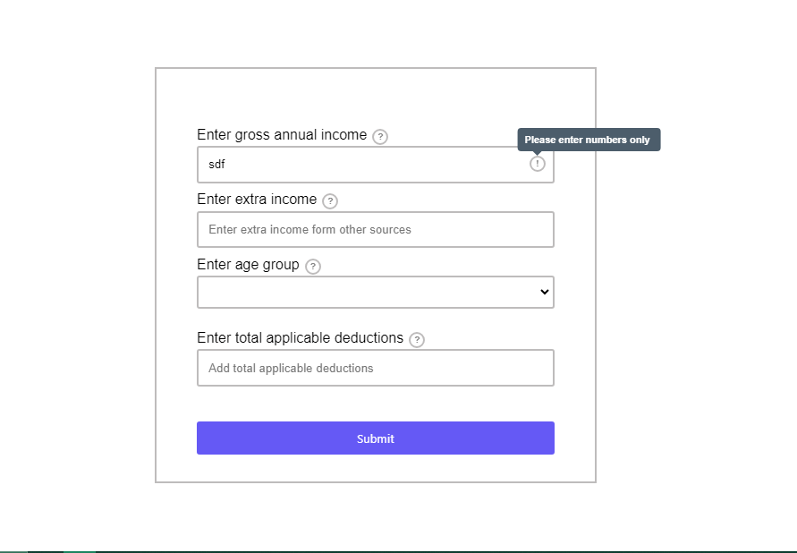
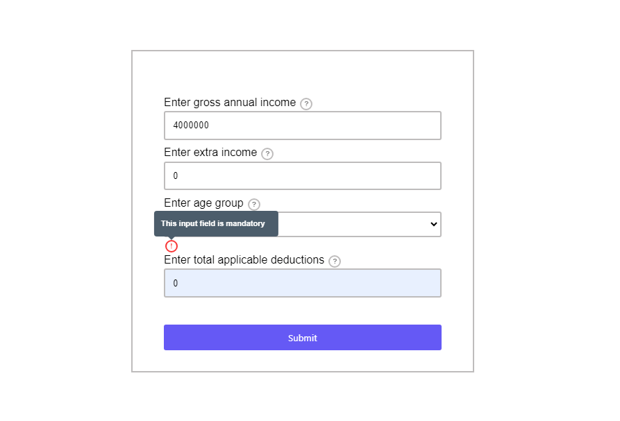
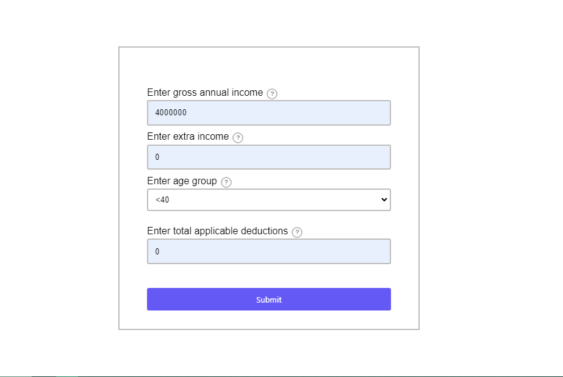

# Tax Calculator Web App

Welcome to the Tax Calculator web application! This application allows users to calculate their income after tax deductions based on various inputs such as gross annual income, extra income, applicable deductions, and age group.

## Table of Contents

- [Introduction](#introduction)
- [Installation](#installation)
- [Usage](#usage)
- [Testing](#testing)
- [Hosted Links](#hosted-links)

## Introduction

This is a simple web application built using HTML, CSS, and JavaScript. It provides a user-friendly interface for calculating taxes based on income and deductions.

### GitHub Repository

- [GitHub Repo](https://github.com/rohitsharma73/Tax-Calculator)

## Installation

To run this project locally, follow these steps:

1. Clone the repository:

    ```bash
    git clone https://github.com/rohitsharma73/Tax-Calculator.git
    ```

2. Navigate to the project directory:

    ```bash
    cd Tax-Calculator
    ```

3. Open the `index.html` file in your web browser.

## Usage

1. Fill in the required fields:
   - Gross Annual Income
   - Extra Income
   - Age Group
   - Applicable Deductions
2. Click the "Submit" button to calculate your income after tax deductions.
3. The result will be displayed in a modal window.

## Testing

Here's a screenshot showing all tests passing:

1. Discription tooltip hovering


2. Number only error message


3. Custome mandatory(required) field error message when click on submit


4. When fill all fields correclty no error found


5. Finall modal pop up 


## Hosted Links

- [Hosted Web App](https://rohitsharma73.github.io/Tax-Calculator/)